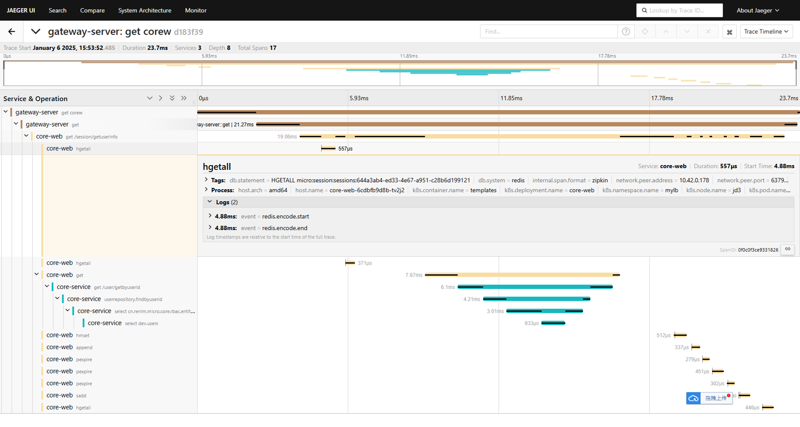
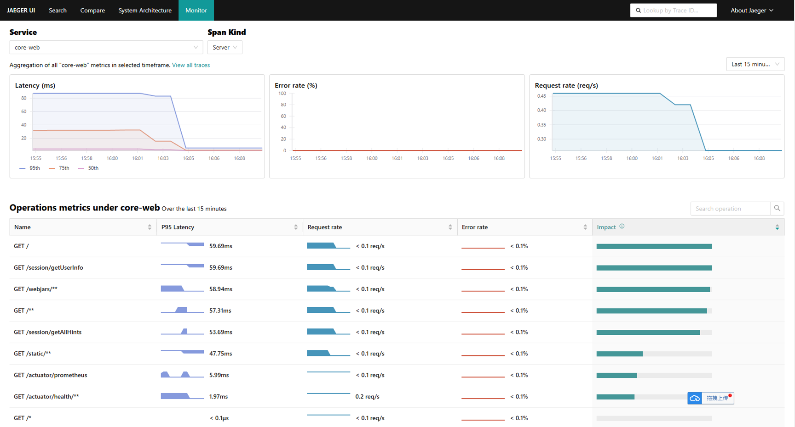
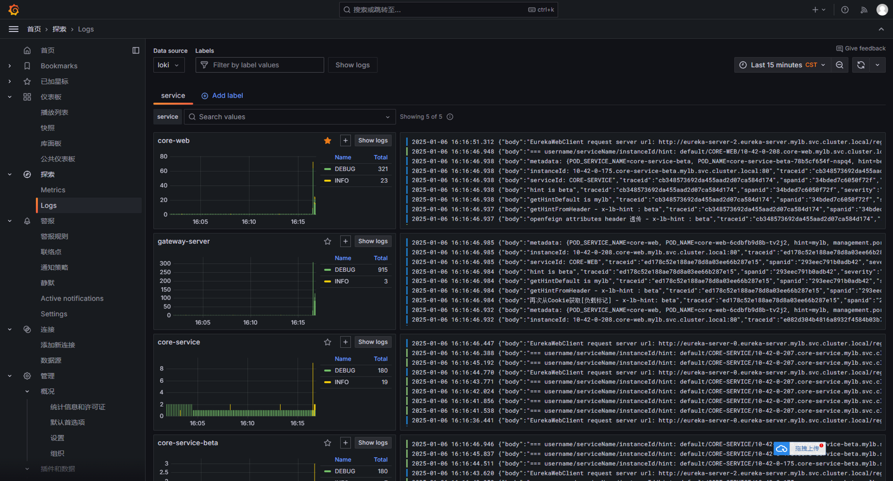
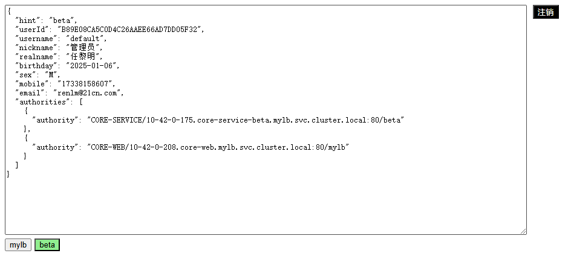

# 微服务模板

<a href="README.docker.md" target="_blank"> Docker版环境配置 </a>  
<a href="README.k3s.md" target="_blank"> K3S版环境配置 </a>  

## 灰度方案
	要实现在微服务架构体系中，服务多版本并行且相互隔离，需要解决两个关键问题：
	1、流量入口负载均衡器的路由
	2、服务间调用的负载路由
	
	思路：
	1、服务注册的元数据信息，要注入当前服务节点版本号
	2、在流量入口处，给经过的每一个请求在Header打标记
	3、自定义负载均衡策略，根据服务元数据的负载标记和请求头进行优先匹配
	4、在流量入口处进行负载标记后，走自定义负载均衡策略
	5、服务间接口调用，透传负载标记请求头
	6、服务间调用，走客户端负载均衡，使用自定义负载均衡策略
		
	目标：
	1、一个微服务集群，共用基础服务的情况下，对其它服务可并行发布多个版本
	2、不同版本的服务，根据负载路由规则相互隔离，互不影响
	3、可由用户自由选择或指定使用哪个版本
	
	实现：
	1、使用 SpringCloud LoadBalancer 实现自定义路由策略，根据请求头[负载标记]与服务元数据进行优先匹配
	2、服务注册时，元数据信息设置版本号，即[负载标记]
	3、服务注册时，注册地址使用pod直连地址，支持StatefulSet和Deployment Headless两种模式
	4、前端负载均衡器给每个请求进行[负载标记]
	5、前端负载均衡器根据[负载标记]执行自定义路由策略进行流量分发
	6、OpenFeign进行服务间调用时，透传请求头的[负载标记]
	7、OpenFeign进行服务间调用时，执行自定义路由策略进行服务调用

## 系统架构

## 网络拓扑

## 链路追踪

## 追踪指标

## 服务日志

## 灰度发布
	登录用户可自由选择访问版本
	core-web只有一个版本mylb，core-service有mylb、beta两个版本
	调用情况如下

