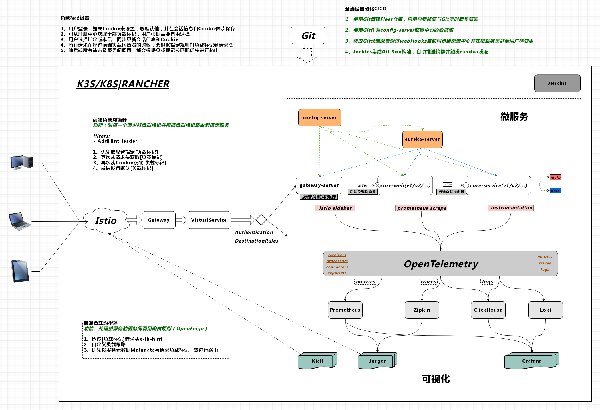

# 微服务模板

<a href="README.docker.md" target="_blank"> Docker版环境配置 </a>  
<a href="README.k3s.md" target="_blank"> K3S版环境配置 </a>  

## 灰度方案
	要实现在微服务架构体系中，服务多版本并行且相互隔离，需要解决两个关键问题：
	1、流量入口负载均衡器的路由
	2、服务间调用的负载路由
	
	思路：
	1、服务注册的元数据信息中，要注入当前服务节点归属的版本号
	2、在流量入口处，给经过的每一个请求在Header打标记
	3、自定义负载均衡策略，根据服务元数据的负载标记和请求头中的负载标记进行优先匹配
	4、在流量入口处进行负载标记后，走自定义负载均衡策略
	5、服务间接口调用，透传负载标记请求头
	6、服务间调用，走客户端负载均衡，使用自定义负载均衡策略
		
	目标：
	1、在一个微服务集群中，共用基础服务的情况下，对其它服务可并行发布多个版本
	2、不同版本的服务，根据负载路由规则相互隔离，互不影响
	3、可由用户自由选择或指定使用哪个版本

## 系统架构

## 网络拓扑

## 链路追踪

## 追踪指标

